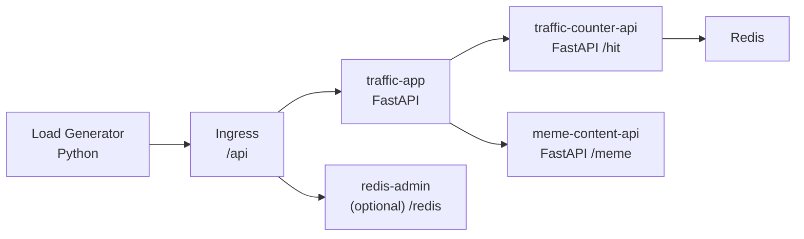

# Traffic App on Kubernetes

SKALA Slack 공지/알림 메시지 조회 시스템이 갑작스러운 10배 트래픽 증가를 견디도록 Kubernetes 환경에서 구성한 예제입니다.

이 프로젝트는 실제 Slack API를 직접 부하테스트하지 않습니다. 대신 Slack 조회 흐름을 내부 서비스로 치환해 같은 아키텍처 패턴을 재현합니다.

- 실제 시나리오의 `Slack 공지/알림 메시지 조회 시스템` -> `traffic-app`
- 실제 시나리오의 `Slack API 조회` -> `meme-content-api`
- 요청 수 기록 / 통계 -> `traffic-counter-api` + `Redis`
- 외부 진입점 -> `Ingress /api`

## 시나리오 매핑

문제 요구사항은 다음 상황을 가정합니다.

- SKALA Slack 공지/알림 메시지 조회 시스템 운영 중
- 특정 이벤트로 트래픽이 평소 대비 10배 증가
- 시스템이 안정적으로 서비스를 유지해야 함
- Kubernetes에서 Deployment, HPA, Redis, Ingress, Docker/Harbor 구성을 포함해야 함

이 저장소에서는 이를 아래와 같이 구현했습니다.

- 사용자는 `Ingress /api`로 요청
- `traffic-app`이 요청을 받아 내부적으로 두 가지 작업 수행
- `traffic-counter-api /hit` 호출로 Redis에 요청 수 저장
- `meme-content-api /meme` 호출로 공지 문구 대체 콘텐츠 조회
- 결과를 합쳐 사용자에게 응답

즉, 테스트 흐름은 아래와 같습니다.

`Client -> Ingress(/api) -> traffic-app -> traffic-counter-api(/hit, Redis) + meme-content-api(/meme) -> Response`

## 아키텍처



핵심 포인트는 외부에서 직접 보이는 서비스는 `traffic-app`뿐이라는 점입니다.

- 외부 노출:
  - `/api` -> `traffic-app`
  - `/redis` -> `redis-admin` (옵션)
- 내부 전용:
  - `traffic-counter-api`
  - `meme-content-api`
  - `redis-service`

## 서비스 구성

| 서비스 | 역할 | 주요 엔드포인트 |
| --- | --- | --- |
| `traffic-app` | 메인 공지/알림 조회 서비스 | `/notice`, `/stats`, `/health/live`, `/health/ready`, `/health` |
| `traffic-counter-api` | Redis 기반 요청 수 카운터 | `/hit`, `/stats`, `/health` |
| `meme-content-api` | Slack API 대체 콘텐츠 제공 | `/meme`, `/health` |
| `redis` | 카운터 데이터 저장소 | N/A |
| `redis-admin` | Redis 관리 UI | `/redis` 경유 접근 |

## API 역할 상세

### traffic-app

- `GET /notice`
  - 먼저 `traffic-counter-api /hit` 호출
  - 그 다음 `meme-content-api /meme` 호출
  - 두 결과를 합쳐 최종 응답 반환
- `GET /notice/track`
  - `traffic-counter-api /hit`만 호출
  - counter 서비스만 별도 부하테스트할 때 사용
- `GET /notice/message`
  - `meme-content-api /meme`만 호출
  - meme 서비스만 별도 부하테스트할 때 사용
- `GET /stats`
  - 프로세스 시작 시간, uptime, 내부 서비스 URL, counter 통계 반환
- `GET /health/live`
  - Liveness probe 용도
- `GET /health/ready`
  - counter/meme 서비스 readiness 확인
- `GET /health`
  - readiness 정보 반환

### traffic-counter-api

- `GET|POST /hit`
  - Redis에 요청 수 +1
  - 최초 호출 시각 / 마지막 호출 시각 저장
- `GET /stats`
  - 현재 누적 요청 수와 시각 정보 반환
- `GET /health`
  - Redis 연결 상태 확인

### meme-content-api

- `GET /meme`
  - 랜덤 축하 문구 또는 밈 문구 반환
- `GET /health`
  - 서비스 상태 확인

## 저장소 구조

```text
.
├── app/                         # traffic-app 메인 FastAPI
├── counter_service/             # Redis 기반 카운터 API
├── meme_content_api/            # 밈/문구 콘텐츠 API
├── k8s/                         # Kubernetes manifests
├── loadtest/                    # Python 부하테스트 스크립트와 결과물
├── scripts/                     # Harbor push, 부하테스트 실행/리포트 스크립트
├── Dockerfile                   # 멀티 스테이지 이미지 빌드
├── docker-compose.yml           # 로컬 실행용
├── requirements.txt             # Python 의존성
└── README.md
```

## Docker 구성

요구사항에 맞춰 Docker 이미지는 멀티 스테이지 빌드로 구성했습니다.

- builder stage에서 Python 의존성 설치
- runtime stage에서 필요한 코드와 가상환경만 복사
- 동일 이미지로 `traffic-app`, `traffic-counter-api`, `meme-content-api`를 실행

관련 파일:

- `Dockerfile`
- `.dockerignore`
- `scripts/harbor-push.sh`
- `harbor.env.example`

### 로컬 이미지 빌드

```bash
docker build -t traffic-app:latest .
```

### Harbor Push

`harbor.env.example`을 복사해 `harbor.env`를 만든 뒤 값을 채웁니다.

```bash
cp harbor.env.example harbor.env
```

필수 환경 변수:

- `HARBOR_REGISTRY`
- `HARBOR_PROJECT`
- `HARBOR_USERNAME`
- `HARBOR_PASSWORD`
- 선택:
  - `IMAGE_NAME` 기본값 `traffic-app`
  - `IMAGE_TAG` 기본값 `latest`

푸시:

```bash
./scripts/harbor-push.sh
```

## Kubernetes 구성

### Deployment

요구사항에 맞춰 주요 Deployment는 다음 설정을 사용합니다.

- `replicas: 2`
- `strategy.type: RollingUpdate`
- `rollingUpdate.maxSurge: 1`
- `rollingUpdate.maxUnavailable: 0`

적용 대상:

- `traffic-app`
- `traffic-counter-api`
- `meme-content-api`

### Redis 연동

Redis는 별도 Pod + Service로 배포합니다.

- Redis Host: `ConfigMap`
- Redis Password: `Secret`
- Redis Service: `redis-service`

설정 방식:

- `redis-config`:
  - `REDIS_HOST=redis-service`
  - `REDIS_PORT=6379`
  - `REDIS_DB=0`
- `redis-secret`:
  - `REDIS_PASSWORD`

### HPA

HPA는 `traffic-app`에 적용했습니다.

- `minReplicas: 2`
- `maxReplicas: 10`
- `averageUtilization: 50` (CPU 50%)

즉, `traffic-app` 평균 CPU 사용률이 50%를 넘으면 자동으로 replica를 늘립니다.

### Ingress

Ingress는 path 기반으로 구성했습니다.

- `/api(/|$)(.*)` -> `traffic-app:8000`
- `/redis(/|$)(.*)` -> `redis-admin:8081`

`nginx.ingress.kubernetes.io/rewrite-target: /$2`를 사용하므로,

- `/api/notice` -> 내부적으로 `traffic-app /notice`
- `/api/health` -> 내부적으로 `traffic-app /health`

로 전달됩니다.

## 주요 Kubernetes 리소스

- `k8s/api-deployment.yaml`
- `k8s/api-service.yaml`
- `k8s/api-hpa.yaml`
- `k8s/api-pdb.yaml`
- `k8s/api-configmap.yaml`
- `k8s/traffic-counter-api-deployment.yaml`
- `k8s/traffic-counter-api-service.yaml`
- `k8s/meme-content-api-deployment.yaml`
- `k8s/meme-content-api-service.yaml`
- `k8s/redis-pod.yaml`
- `k8s/redis-service.yaml`
- `k8s/redis-configmap.yaml`
- `k8s/redis-secret.yaml`
- `k8s/redis-admin-deployment.yaml`
- `k8s/redis-admin-service.yaml`
- `k8s/ingress.yaml`

## 로컬 실행

### docker compose

```bash
python3 -m venv .venv
source .venv/bin/activate
pip install -r requirements.txt
docker compose up --build
```

접속 주소:

- `traffic-app`: `http://localhost:8000`
- `traffic-counter-api`: `http://localhost:9000`
- `meme-content-api`: `http://localhost:9100`

간단 확인:

```bash
curl http://localhost:8000/notice
curl http://localhost:8000/stats
curl http://localhost:9000/stats
curl http://localhost:9100/meme
```

## Minikube 배포

### 사전 준비

```bash
minikube start
minikube addons enable ingress
minikube addons enable metrics-server
```

`metrics-server`는 HPA가 CPU를 읽기 위해 반드시 필요합니다.

### 이미지 준비 및 배포

현재 예제 매니페스트는 로컬 Minikube 테스트 기준으로 `traffic-app:latest` 이미지를 사용합니다.

```bash
minikube image build -t traffic-app:latest .
kubectl apply -f k8s/
```

코드를 수정한 뒤 이미 반영된 Deployment에 새 이미지를 적용하려면:

```bash
minikube image build -t traffic-app:latest .
kubectl rollout restart deployment/traffic-app
```

상태 확인:

```bash
kubectl get pods
kubectl get svc
kubectl get ingress
kubectl get hpa
kubectl top nodes
kubectl top pods
```

### Ingress 접근 주의

로컬 macOS + Minikube + Docker driver 조합에서는 Ingress IP에 직접 붙는 방식이 불안정할 수 있습니다.

그래서 이 프로젝트에서는 부하테스트를 Ingress 경유가 아니라 `traffic-app` Service에 직접 `kubectl port-forward`를 걸어 수행합니다.

이 방식의 장점:

- 임시 로컬 프록시 병목 감소
- connection error 감소
- HPA와 Pod 변화 관찰이 더 명확함

## 부하테스트

### 원칙

부하테스트의 목적은 단순히 많은 요청을 보내는 것이 아니라 다음을 동시에 확인하는 것입니다.

- 성공률
- 지연시간 평균 / p95 / max
- HPA가 CPU 50% 이상에서 실제로 scale-out 하는지
- Pod가 Ready 상태를 유지하는지
- `traffic-counter-api`, `meme-content-api`, Redis가 병목이 아닌지

테스트 대상 경로는 목적에 따라 나눌 수 있습니다.

- 전체 비즈니스 흐름: `TEST_TARGET=full`
- counter 서비스 경로만 검증: `TEST_TARGET=counter`
- meme 서비스 경로만 검증: `TEST_TARGET=meme`

각 모드는 별도로 한 번씩 실행하는 방식입니다. 한 명령이 끝난 뒤 다음 명령을 실행하면 됩니다.

### 원클릭 부하테스트 + 결과 리포트

```bash
chmod +x scripts/run_portforward_load_test.sh
./scripts/run_portforward_load_test.sh
```

이 명령은 기본값으로 `TEST_TARGET=full`을 사용합니다.

강도를 올리려면:

```bash
CONCURRENCY=200 DURATION=180 ./scripts/run_portforward_load_test.sh
```

counter 서비스만 검증하려면:

```bash
TEST_TARGET=counter ./scripts/run_portforward_load_test.sh
```

meme 서비스만 검증하려면:

```bash
TEST_TARGET=meme ./scripts/run_portforward_load_test.sh
```

세 가지를 순서대로 각각 실행하는 예시는 다음과 같습니다.

```bash
./scripts/run_portforward_load_test.sh
TEST_TARGET=counter ./scripts/run_portforward_load_test.sh
TEST_TARGET=meme ./scripts/run_portforward_load_test.sh
```

지원 환경 변수:

- `NAMESPACE` 기본값 `default`
- `LOCAL_PORT` 기본값 `8000`
- `TEST_TARGET` 기본값 `full`
  - `full` -> `/notice`
  - `counter` -> `/notice/track`
  - `meme` -> `/notice/message`
- `CONCURRENCY` 기본값 `100`
- `DURATION` 기본값 `120`
- `THINK_TIME` 기본값 `0.0`
- `SAMPLE_INTERVAL` 기본값 `5`

이 스크립트가 수행하는 작업:

1. `traffic-app` Service에 `kubectl port-forward`
2. Python 부하테스트 실행
3. HPA 샘플 수집
4. `traffic-app`, `traffic-counter-api`, `meme-content-api` Pod 상태 수집
5. `kubectl top` 기반 CPU/메모리 샘플 수집
6. 테스트 전후 `/health`, `/stats` 스냅샷 저장
7. 서비스 로그 수집
8. Markdown 리포트 생성

### 생성 결과

결과는 아래 경로에 저장됩니다.

```text
loadtest/results/portforward-loadtest-<timestamp>/
```

주요 산출물:

- `summary.md`
- `run.log`
- `python-loadtest-summary.json`
- `hpa-samples.tsv`
- `pod-samples.tsv`
- `top-samples.tsv`
- `traffic-app.logs`
- `traffic-counter-api.logs`
- `meme-content-api.logs`

### 단독 Python 부하테스트

```bash
python3 loadtest/python_load_test.py --url http://127.0.0.1:8000/notice --concurrency 50 --duration 60
```

counter 경로만 직접 테스트하려면:

```bash
python3 loadtest/python_load_test.py --url http://127.0.0.1:8000/notice/track --concurrency 50 --duration 60
```

meme 경로만 직접 테스트하려면:

```bash
python3 loadtest/python_load_test.py --url http://127.0.0.1:8000/notice/message --concurrency 50 --duration 60
```

JSON 결과까지 저장하려면:

```bash
python3 loadtest/python_load_test.py \
  --url http://127.0.0.1:8000/notice \
  --concurrency 50 \
  --duration 60 \
  --json-out loadtest-summary.json
```

## 부하테스트 결과를 볼 때 체크할 항목

### 1. 성공률

- `/notice` 성공률이 99% 이상인지
- connection error, timeout, 5xx가 얼마나 발생하는지

### 2. 지연시간

- 평균보다 `p95`와 `max`를 더 중요하게 봐야 함
- 부하가 올라갈수록 급격히 튀는지 확인

### 3. HPA 반응

- CPU 50% 이상일 때 replica가 늘어나는지
- 부하 종료 후 다시 안정 상태로 수렴하는지

### 4. Pod 상태

- 새 Pod가 Ready까지 정상 진입하는지
- 재시작, CrashLoopBackOff, readiness 실패가 있는지

### 5. 내부 서비스 병목

- `traffic-counter-api` latency 증가 여부
- `meme-content-api` 오류 여부
- Redis 카운터 증가량이 성공 응답 수와 비슷한지

## HPA / metrics-server 확인

다음 명령이 정상 동작해야 HPA를 신뢰할 수 있습니다.

```bash
kubectl get hpa traffic-app
kubectl top nodes
kubectl top pods -l app=traffic-app
```

정상 예시:

- `kubectl get hpa traffic-app` -> `cpu: 4%/50%`
- `kubectl top pods -l app=traffic-app` -> Pod별 CPU/메모리 값 출력

만약 `cpu: <unknown>/50%` 또는 `Metrics API not available`가 보이면:

```bash
minikube addons enable metrics-server
kubectl get apiservices | grep metrics
kubectl top nodes
```

## 제출/발표 시 설명 포인트

이 프로젝트는 실제 Slack API를 직접 두드리는 대신, Slack 조회 흐름을 내부 콘텐츠 API로 대체해 인프라 구조와 확장 동작을 검증합니다.

설명 포인트는 다음이 자연스럽습니다.

- `traffic-app`이 실제 비즈니스 서비스 역할
- `meme-content-api`는 Slack API 대체 upstream
- `traffic-counter-api`는 요청 수 기록 전용 내부 API
- Ingress는 `/api`만 외부 공개
- Redis는 카운터 저장소
- HPA는 `traffic-app`에 적용해 급증 트래픽 대응
- 부하테스트는 내부 서비스 조합 전체를 대상으로 수행

## 참고 파일

- `app/main.py`
- `counter_service/main.py`
- `meme_content_api/main.py`
- `scripts/run_portforward_load_test.sh`
- `scripts/render_load_test_report.py`
- `loadtest/python_load_test.py`
